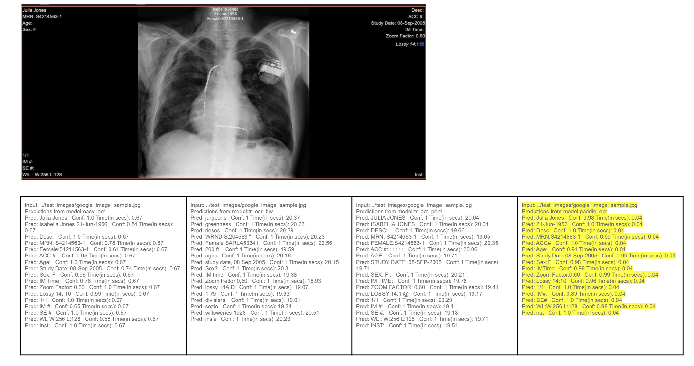

# Image text redaction
Evaluation of  models for image text detection, recognition, and redaction. The evaluated models can detect horizontal print and handwritten text. Detection of curved text is beyond scope of these models although angled text in some orientations can be detected by one or mode or the models. The redaction module is a dummy placeholder that redacts any text that is recognized. It needs to be updated to selectively redact text based on use case.

Three models evaluated 
- [easy ocr](https://github.com/JaidedAI/EasyOCR)
- [TR OCR](https://github.com/microsoft/unilm/tree/master/trocr) It is also available on [Huggingface](https://huggingface.co/microsoft/trocr-base-handwritten)
- [Paddle OCR](https://github.com/PaddlePaddle/PaddleOCR)

_For TR OCR, both handwritten and print text models are tested_

[Sample XRAY Image from Google Healthcare API page](https://cloud.google.com/architecture/de-identification-of-medical-images-through-the-cloud-healthcare-api)

# Notes
- Current bbox output of OCR models are coalesced to form bboxes around phrases (SnapToLineGrid.py). Additional info of bbox coalaescing around regions needs to be done to assist Deidentification. This will be optional information. Line based coalescing is requried for model that only do recognition (TROCR). They cant accept multiline regions.
- Try other fully transformer based models  that are emerging. 
- TRCOR recognition is quite slow compared to PaddleOCR and EasyOCR. The latter two are on average in tens of milliseconds for an entire image whereas TROCR takes time in order of seconds for each text region within an image. For pure evaluation CPUs may suffice, given this caveat

### License

This repository is covered by MIT license. 
